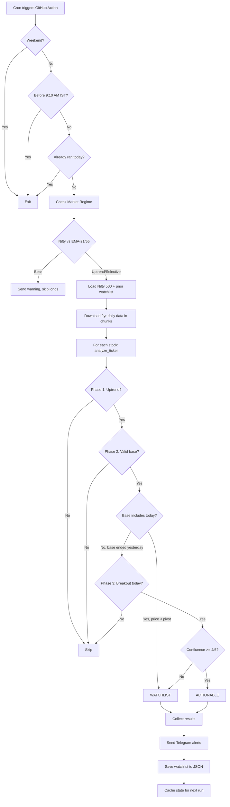

# NSE Momentum Burst Scanner — System Outline

## Scanner Workflow

## Phase Detection Summary

| Phase | What it checks | Playbook rule |
|-------|---------------|---------------|
| **Market Regime** | Nifty 50 vs EMA-21, EMA-55 | Above both + pointing up = Uptrend; Between = Selective; Below both = Bear |
| **Phase 1: Uptrend** | Stock's EMA stack + momentum | EMA-8 > EMA-21 > EMA-55, EMA-144 rising, U/D ratio ≥ 1.4 |
| **Phase 2: Base** | 5-15 day consolidation | Small candles, quiet volume, no close < EMA-21, no 3 down days, no distribution, price near pivot |
| **Phase 3: Breakout** | Today's candle quality | Close > pivot, body > 60%, close in top 10%, RVol ≥ 1.5x, move ≥ 4%, not chasing, confluence ≥ 4/6 |

## GitHub Actions Cron Schedule

The workflow needs **3 cron triggers** aligned with Indian market hours (IST = UTC+5:30):

| IST Time | UTC Cron | Purpose |
|----------|----------|---------|
| **9:10 AM** | `40 3 * * 1-5` | Pre-market scan — check watchlist stocks at open |
| **11:00 AM** | `30 5 * * 1-5` | Mid-morning — catch breakouts in first 2 hours |
| **3:35 PM** | `5 10 * * 1-5` | EOD — final scan, save watchlist for tomorrow |

## State Persistence

The `watchlist_persistent.json` is cached between runs using GitHub Actions cache.

> [!WARNING]
> **Current bug**: The cache key uses `github.run_id` which is unique per run, so state is NEVER properly restored. It should use a fixed key with date-based rotation.

## Workflow Issues to Fix
1. **No cron schedule** — only `workflow_dispatch` (manual trigger)
2. **Cache key is broken** — `state-${{ github.run_id }}` creates a new key every run
3. **State never persists** — each run starts with an empty watchlist
